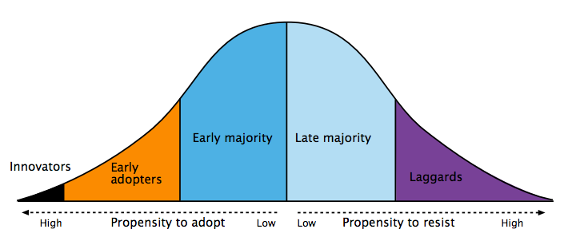

# 42436-commercialization
Repo for DTU 42436 Commercialization of high tech concepts, entrepreneurship and science in action

## Lecture 2

**Team over Idea** - *"Always consider investing in a grade A man with a grade B idea. Never invest in a grade B man with a grade A idea."* -Georges Doriot

**VC priority list**
  * Industry experience
  * Education type
  * Education level
  * Acquaintance
  * Leadership experience

**New teams**:
* try to focus on **strengthening relationships** rather than **future opportunities**.

**When doing case studies**
* Separate assessment:
  * the team
  * the business idea

## Lecture 3
#### Business case: DTU Food ~ CP Kelco
* Technology: E407 stabilizer (Carrageenan) is made from SeaWeed, is in a lot of food.
* There's a big industry in extracting stabilizer from sea weed: $6 DKK a year
* Used as meat glue, keeps cacao in consistency, clarifies beer, found in toothpaste, shaving foam and much more.
* Currently 30% of sea weed is used to extract Carrageenan
* Leftovers are mixed with pectin waste / manure for biofuel (low value)
* optimized process by extracting other products before Carrageenan extraction (which damages)
  * Protein extraction. This increases Carrageenan quality. Main extraction. Resembles beef protein much more than Soy, Rice or Hemp protein
  * Natural coloring agent extraction.
  * Vegan substitutes
  * Stabilizer for skin-cream
* Resources:
  * [Research paper: Proteins and Carbohydrates from Red Seaweeds: Evidence for Beneficial Effects on Gut Function and Microbiota](https://www.ncbi.nlm.nih.gov/pmc/articles/PMC4557026/)
  * [CPKelco History](https://www.cpkelco.com/about-cp-kelco/our-history/)
  * [CPKelco Carrageenan](https://www.cpkelco.com/products/carrageenan/)

#### Lecture 2 recap
* Team is much more important than idea
* 90% of startups fail because of the team-related problems

#### Student cases
* Kurnell Sound
* Inspectite

# LED tech for dental / nedical use
* Paul Michael Petersen, DTU guy from the dinosaur era.
* Diagnostics and disinfection
* LED technology is taking over en masse
  * primarily for lighting - currently accounts for 20%-50% of energy consumption with traditional (incandescent) lighting
  * LEDs spend a fraction of traditional lighting and are getting better and better.
  * LEDs are good for reducing energy consumption (esp. when energy isn't readily available)
* LEDs in the medical industry
  * LEDs can be used to cure filling material i.e liquid is poured into a filling gap, LEDs make it freeze instantly.
  * Narrowband imaging lets you you see capillaries under the skin surface at varying depths.
  * Bacterial disinfection via LEDs
    * Works similarly to the sun, grey summers are accompanies by copious algae growth.
    * Reduce consumption of antibiotic
    * Irradiate salmonella and MRSA at slaughterhouses
    * Optimal wavelength for killing bacteria 296 nm
  * Using LED lights in pig farms greatly reduces the use of antibiotics
* The semiconductor industry is huge. Semiconductors make LEDs shine.

## Lecture 4 - Market Opportunity Navigator
* Dilemma - which mountain to climb? can I move to a different mountain, while climbing?
* Market opportunities:
  * which exist?
  * which are best?
  * ???
* **Market opportunity set** - Set of opportunities

## Lecture 5

Theory of diffusion in innovation

* Innovators / Early adopters
* Majority
* Laggards
